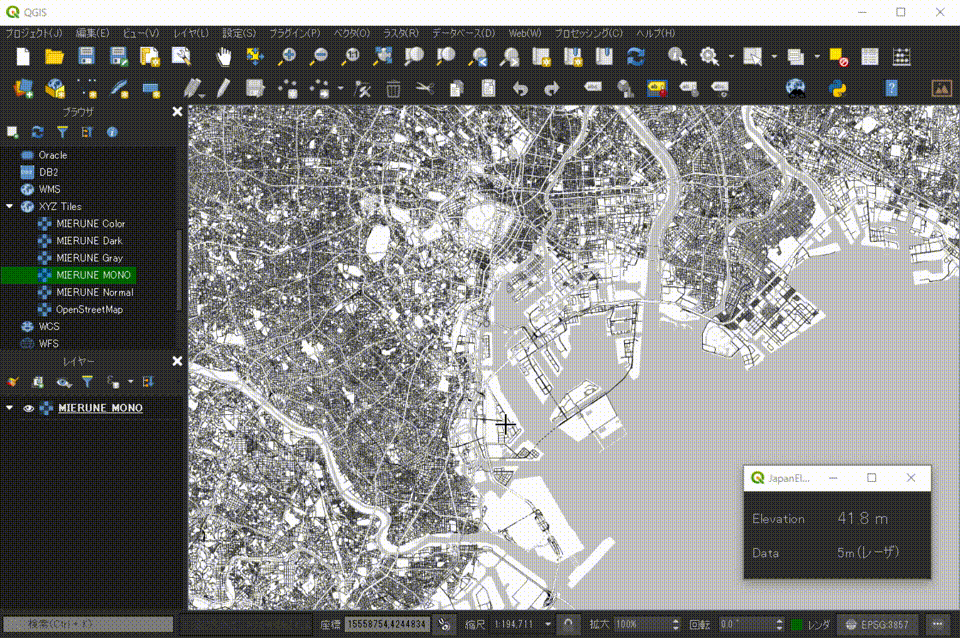

# JapanElevation

Display elevation value of specified position on QGIS.(QGISv3)  
Using [Elevation API](http://maps.gsi.go.jp/development/api.html) by Geospatial Information Authority of Japan.  

[QGIS Python Plugins Repository](https://plugins.qgis.org/plugins/JapanElevation)  

[QGISv2 Repository](https://github.com/dayjournal/JapanElevation/tree/QGIS2)  

 

### Other country version  
[AustrianElevation](https://github.com/maegger/AustrianElevation)

 

## Usage

- Click "JapanElevation".
- Click the designated position to display the elevation value.

 

## License
Python modules are released under the GNU General Public License v2.0

Copyright (c) 2018 Yasunori Kirimoto

 

---

 

### Japanese

 

# 標高値取得

QGISで指定位置の標高値を表示(QGISv3)  
国土地理院の[標高API](http://maps.gsi.go.jp/development/api.html)を利用

[QGIS Python Plugins Repository](https://plugins.qgis.org/plugins/JapanElevation)  

[QGISv2 Repository](https://github.com/dayjournal/JapanElevation/tree/QGIS2)  

 

##  使用方法

- JapanElevationボタンクリック  
- 指定位置クリックで標高値表示  

 

## ライセンス
Python modules are released under the GNU General Public License v2.0

Copyright (c) 2018 Yasunori Kirimoto

 

---
